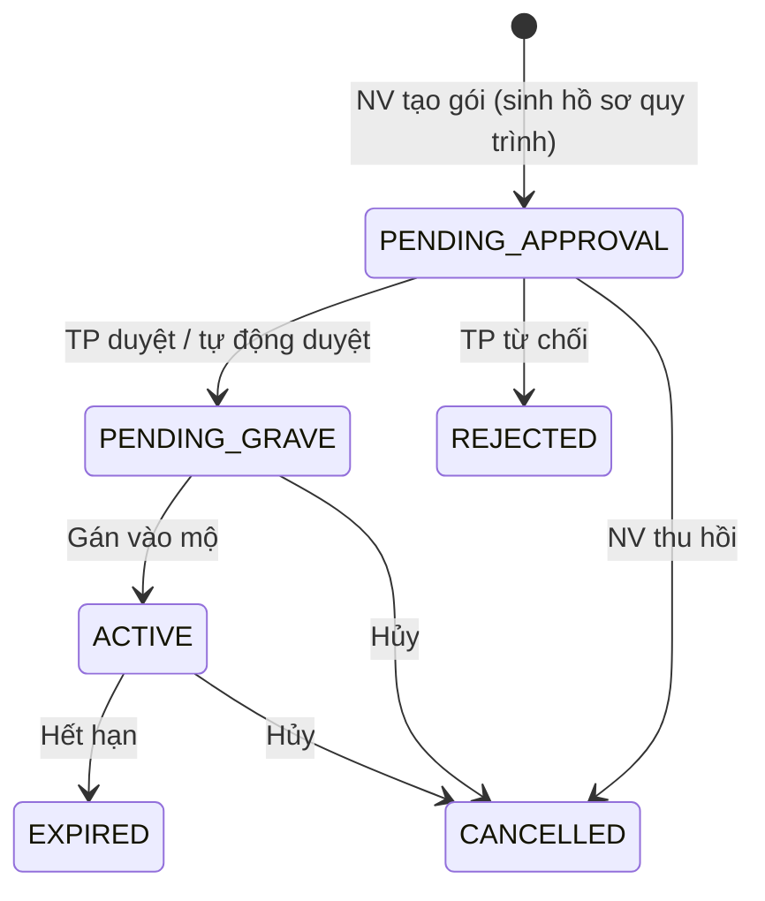

# Thiết kế: Phê duyệt khi gán Gói dịch vụ/chăm sóc cho khách hàng

- Trạng thái: **NHÁP v4 — chờ chủ sở hữu (Đào Hải Bách) duyệt trước khi chạm code**
- Phạm vi: gắn quy trình phê duyệt vào luồng gán gói cho khách hàng
- Liên quan: [approval-workflow-rules.md](./approval-workflow-rules.md), [business-rules.md](./business-rules.md), [process-catalog.md](./process-catalog.md), [permission-catalog.md](./permission-catalog.md)
- Ngày dựng: 2026-08-13 · v3 sau khi chốt Q1–Q8 và kiểm tra phân quyền

> Tài liệu này là **đề xuất đang bàn**, chưa phải hồ sơ trình duyệt. Chưa có dòng code nào được thay đổi.

---

## 1. Yêu cầu nghiệp vụ

- (a) Dịch vụ gán cho khách phải **lấy từ danh mục gói**.
- (b) **Nhân viên tạo → Trưởng phòng của nhân viên đó duyệt.**
- (c) Duyệt xong → gói **hiện trong màn Khách hàng** → lúc đó mới **gán vào mộ**.

## 2. Bảng quyết định đã chốt

| # | Nội dung | Quyết định |
|---|---|---|
| D1 | 3 mô hình gói chồng lấn | **Trước mắt giữ `CustomerCarePackage`.** Nhưng D8 = H3 nghĩa là **hợp nhất sẽ xảy ra** — xem §7 |
| D2 | Cách xác định người duyệt | **Trưởng phòng của người tạo** — tra qua **bảng thẩm quyền** (D11) |
| D3 | Gói chờ duyệt hiển thị | **Hiện trong màn Khách hàng, nhãn "Chờ duyệt"**, chưa thao tác được |
| D4 | TP tự tạo gói | **Tự động duyệt, CÓ lưu vết vào nhật ký** — xem §4 |
| D5 | Khai báo trưởng phòng | **Giai đoạn chạy thử: CNTT nạp tay.** Màn quản trị làm sau. ⚠️ Xem §5 về cửa quyền |
| D6 | Phạm vi liên kết quy trình | **COMPANY** — theo từng công ty |
| D7 | Duyệt nhiều cấp về sau | **Có** — sau này lên tới Giám đốc. Thiết kế phải mở rộng được |
| D8 | Báo cáo doanh thu | **Tách hồ sơ riêng**, làm theo **H3 — hợp nhất mô hình gói rồi báo cáo** |
| D9 | Nghỉ phép | Admin duyệt tay **+** ủy quyền bằng tay con người. **Con người đè quy tắc tự động** |
| D10 | Kiểu ủy quyền | **THAY THẾ** — chỉ người được ủy quyền duyệt được. ⚠️ Xem §6, khác đặc tả hiện hành |
| D11 | Nơi lưu thẩm quyền phê duyệt | **Bảng `Approval_Authorities` riêng, có mã quyền riêng** — KHÔNG thêm cột vào bảng phòng ban. Xem §5 |

## 3. Hiện trạng codebase (đã điều tra)

Engine quy trình đã có, tổng quát, cấu hình bằng dữ liệu. Luồng gán gói hiện **chưa có phê duyệt**:
```
Create(khách + loại gói)  →  PENDING_GRAVE  →  AssignGrave(mộ)  →  ACTIVE
```

Khoảng trống chặn "trưởng phòng của người tạo":
1. `Department` **không có `HeadUserId`**; `UserDepartmentAssignment` không có cờ trưởng/phó; `User` không có `ManagerId`.
2. `ApproverResolver` chỉ xử lý `SPECIFIC_USER, ROLE, ADMIN_GROUP, DEPARTMENT, PERMISSION`. Cấu hình *chấp nhận* `DEPARTMENT_MANAGER`/`REQUESTER_MANAGER` nhưng runtime trả rỗng → `WF_NO_ASSIGNEE_FOR_STEP`.
3. Nguồn `DEPARTMENT` trả **toàn bộ** thành viên phòng, không phải trưởng phòng.
4. `ApproverResolver` **không lọc trạng thái người dùng** → người đã khóa/nghỉ việc vẫn được giao duyệt; danh sách là ảnh chụp lúc gửi nên hồ sơ treo **kẹt vĩnh viễn**.

## 4. Trạng thái mới & tự động duyệt (D4)



Gói chỉ **gán được vào mộ** từ `PENDING_GRAVE` trở đi.

**Tự động duyệt có ghi dấu** (khi người tạo chính là TP):
- Hồ sơ quy trình **vẫn sinh ra** — không bỏ bước.
- Ghi `WorkflowAction` với lý do rõ: *"Tự động duyệt — người đề xuất là Trưởng phòng, không có cấp duyệt khác"*.
- Ghi audit `APPROVAL_AUTO_APPROVED`, `ActorUserId` = người tạo.
- **Chỉ áp cho đúng bước mà người tạo là người duyệt bước đó.** Bước cấp trên (Giám đốc — D7) **vẫn chạy bình thường**.

Lưu ý kỹ thuật: luật *người đề xuất ≠ người duyệt* đang thực thi ở nhiều tầng (`ApproverResolver` loại người tạo; reassign chặn `WF_REQUESTER_IS_APPROVER`). Phần tự động duyệt phải là **ngoại lệ khai báo tường minh**, không phải nới lỏng luật chung.

## 5. Nhóm A — Bảng Thẩm quyền phê duyệt *(D11 — thay cho cách cũ)*

> **Đổi hướng thiết kế theo chỉ đạo của anh Bách:** không nhét `HeadUserId` vào bảng phòng ban, mà **tách hẳn một bảng thẩm quyền phê duyệt riêng**. Lý do: thẩm quyền phê duyệt là **khái niệm độc lập**, không phải thuộc tính của cơ cấu tổ chức. Cách cũ giữ lại ở §5.4 để đối chiếu.

### 5.1 Bảng `Approval_Authorities`

| Cột | Ý nghĩa | Giải quyết |
|---|---|---|
| `CompanyId` | Công ty áp dụng | D6 — phạm vi theo công ty |
| `DepartmentId` | Phòng ban áp dụng | "Trưởng phòng của người tạo" |
| `ProcessCode` *(null = mọi quy trình)* | Áp cho nghiệp vụ nào | Dùng lại cho **mọi** quy trình, không riêng gói |
| `ApproverUserId` | Ai được duyệt | |
| `AuthorityLevel` | Cấp 1 = TP, cấp 2 = GĐ… | **D7 — nhiều cấp, thêm dòng là xong** |
| `MinAmount` / `MaxAmount` *(null = không giới hạn)* | Ngưỡng tiền | *"Giá trị lớn thì lên GĐ"* thành **dữ liệu** |
| `EffectiveFrom` / `EffectiveTo` | Hạn hiệu lực | **D9 — nghỉ phép** |
| `DelegatedFromUserId` *(null)* | Dòng này là ủy quyền thay ai | **D10 — ngữ nghĩa thay thế** |
| `Status`, `RowVersion`, trường kiểm toán | | |

### 5.2 Nguyên tắc kỷ luật kiến trúc

Bảng này là **NGUỒN DỮ LIỆU**, **không phải engine thứ hai.** Engine quy trình vẫn là nơi quyết định luồng chạy. `WorkflowStepApproverRule` vốn là cặp `(ApproverSourceType, ApproverSourceValue)` tổng quát *(đã xác minh trong code)*, nên chỉ cần thêm **một loại nguồn mới** `APPROVAL_AUTHORITY` với giá trị = cấp thẩm quyền. Bước duyệt khai: *"lấy người duyệt từ bảng thẩm quyền, cấp 1"*.

⚠️ **Không được** để hai nơi cùng phán về người duyệt — sẽ có ngày chúng nói ngược nhau.

### 5.3 Đầu việc

| # | Việc | File dự kiến |
|---|---|---|
| A1 | Entity + bảng `Approval_Authorities` + migration | `PTKD.Domain/...` + migration mới |
| A2 | **Mã quyền riêng** cho khai báo thẩm quyền (VD `APPROVAL_AUTHORITY_MANAGE`) | `PermissionCodes.cs` + seed |
| A3 | Service CRUD thẩm quyền + controller (canh bằng mã quyền A2) | mới |
| A4 | Loại nguồn mới `APPROVAL_AUTHORITY` trong resolver | `Workflows/Services/ApproverResolver.cs` |
| A5 | Chặn bẫy: từ chối rule với source type resolver chưa hỗ trợ | `WorkflowConfigurationService.cs` |
| A6 | **Lọc người dùng đã khóa/nghỉ việc khi resolve** + chính sách hồ sơ treo | `ApproverResolver.cs` |
| A7 | Nạp dữ liệu thẩm quyền cho pilot (CNTT nạp tay — D5) | script/seed |
| A8 | FE: màn khai báo thẩm quyền phê duyệt | mới |

**Logic A4:**
```
APPROVAL_AUTHORITY (giá trị = cấp):
  dept = phòng chính đang hiệu lực của người tạo
  rows = Approval_Authorities.where(
           CompanyId, DepartmentId=dept, AuthorityLevel=cấp,
           ProcessCode ∈ {mã quy trình, null},
           đang trong hạn hiệu lực,
           số tiền hồ sơ ∈ [MinAmount, MaxAmount])
  nếu có dòng DelegatedFromUserId  -> CHỈ dùng dòng ủy quyền (thay thế — D10)
  nếu rỗng                          -> lỗi cấu hình rõ ràng
  nếu chỉ còn chính người tạo       -> TỰ ĐỘNG DUYỆT có ghi dấu (§4)
  return danh sách người duyệt
```

### 5.4 Lợi ích so với cách cũ (thêm cột vào phòng ban)

| | Cách cũ | Bảng thẩm quyền riêng |
|---|---|---|
| Cửa quyền | Rơi vào quyền sửa phòng ban (thấp) | **Mã quyền riêng** ✅ |
| Nhiều cấp duyệt (D7) | Phải sửa code | **Thêm dòng dữ liệu** ✅ |
| Ngưỡng tiền | Phải viết code | **Dữ liệu** ✅ |
| Nghỉ phép (D9/D10) | Cần cả bảng ủy quyền riêng (7 đầu việc) | **Hạn hiệu lực trên chính bảng này** ✅ |
| Nhiều người duyệt cùng cấp | Không — một phòng một trưởng | **Được** ✅ |
| Qua đợt hợp nhất H3 | Giữ nguyên | Giữ nguyên ✅ |
| Cơ cấu tổ chức | Bị lẫn ngữ nghĩa phê duyệt | **Sạch** ✅ |

### ⚠️ Bối cảnh phân quyền — vì sao phải tách bảng

Kết quả kiểm tra phân quyền (đo trong code):

| Điều | Trạng thái |
|---|---|
| Mọi đường cấp quyền ở khu vực bảo mật đều cần **quyền quản trị bảo mật** | ✅ Đúng — nhân viên thường **không** tự phong được |
| Không có endpoint tự phục vụ nào đụng bảng phân quyền | ✅ Đúng |
| Đánh giá quyền: **CẤM thắng mọi thứ**, có hạn hiệu lực, lỗi thì đóng cửa | ✅ Chắc |
| **Bảng phòng ban do quyền quản lý phòng ban canh — KHÔNG phải quyền quản trị bảo mật** | ⚠️ Cửa thấp hơn |
| Người có **quyền quản lý người dùng** có thể **tự chuyển mình sang phòng khác** và thừa hưởng quyền nền phòng đó | ⚠️ Đường vòng |
| Không có cơ chế cấm tự thao tác lên chính mình ở bất kỳ tầng nào | ⚠️ Thiếu "bốn mắt" |
| **Thay đổi phân quyền KHÔNG ghi nhật ký kiểm toán** (trong khi gắn thẻ, sửa khách hàng đều ghi) | ⚠️ Đã tách hồ sơ riêng |

**Hệ quả:** nếu đặt `HeadUserId` vào bảng phòng ban, thì **ai sửa được phòng ban là sửa được người duyệt tiền**. Đây chính là lý do tách bảng thẩm quyền riêng với **mã quyền riêng** (A2) — nút thắt được gỡ tận gốc thay vì đi tìm cửa quyền vừa vặn.

*Chưa đo được:* thực tế ai đang giữ các quyền đó và quyền nền từng phòng là gì — mới đọc code, chưa đọc dữ liệu CSDL.

## 6. Nhóm B — Người duyệt nghỉ phép (D9, D10)

**Nguyên tắc anh Bách nêu:** *"Người dân đi theo đèn giao thông, nhưng có công an phân luồng thì tuân theo công an."* → **quy tắc tự động là mặc định; khi có con người điều phối thì nghe con người.**

**Hiện có:** chỉ admin chuyển tay từng bước (quyền `WORKFLOW_REASSIGN_PENDING`). Người nghỉ phép **không tự bàn giao được**; giao diện bắt gõ **số ID người dùng**; chuyển tay là *cộng thêm* chứ không thay thế.

**Đã có đặc tả sẵn, chưa có code:** mô hình Ủy quyền `DEL-001..008` (business-rules.md), `DEL-01..06` (acceptance-criteria.md), approval-workflow-rules.md §11. Bảng `Workflow_Actions` **đã có sẵn cột `OnBehalfOf` và `DelegationId`** bỏ trống. Mã quyền `DELEGATION_CREATE`/`DELEGATION_ACTIVATE` có trong danh mục tài liệu nhưng chưa seed.

### ⚠️ D10 khác với đặc tả hiện hành

| | |
|---|---|
| Đặc tả hiện hành (DEL-001..008) | Ủy quyền là **cộng thêm** — cả hai đều duyệt được |
| Quyết định của anh Bách (D10) | Ủy quyền là **thay thế** — chỉ người được ủy quyền duyệt được |

Theo thứ tự ưu tiên của hệ (*Quyết định người có thẩm quyền > Tài liệu hiệu lực*), quyết định của anh thắng — **nhưng phải cập nhật lại đặc tả** `business-rules.md`/`acceptance-criteria.md`, không để hai nguồn nói ngược nhau.

### Nhóm B co lại nhờ bảng thẩm quyền (D11)

Trước khi tách bảng, nhóm này cần **cả một bảng ủy quyền riêng, 7 đầu việc**. Nay nghỉ phép chỉ là **thao tác dữ liệu trên bảng thẩm quyền**: đặt `EffectiveTo` cho dòng của TP, thêm dòng cho người thay với `DelegatedFromUserId` trỏ về TP. Ngữ nghĩa **thay thế** (D10) là tự nhiên — không cần cơ chế đè.

| # | Việc còn lại |
|---|---|
| B1 | Quy tắc chọn dòng: **có dòng ủy quyền thì CHỈ dùng dòng ủy quyền** (đã gộp vào logic A4) |
| B2 | **Đánh giá tại thời điểm hành động**, không chỉ lúc gửi duyệt — vì danh sách người duyệt là ảnh chụp lúc gửi; ủy quyền lập sau sẽ vô tác dụng với hồ sơ đang treo nếu chỉ xét lúc gửi |
| B3 | Ghi `OnBehalfOf`/`DelegationId` vào nhật ký (cột đã có sẵn) |
| B4 | FE: hiển thị "A duyệt thay B" |
| B5 | **Cập nhật đặc tả DEL-001..008** cho khớp ngữ nghĩa thay thế |

Giữ nguyên đường admin chuyển tay hiện có (`WORKFLOW_REASSIGN_PENDING`) làm lối thoát khẩn cấp.

## 7. Nhóm C — Gắn phê duyệt vào luồng gán gói

| # | Việc | File dự kiến |
|---|---|---|
| C1 | Mã nghiệp vụ `ASSIGN_CARE_PACKAGE` | seed `BusinessProcessCatalog` + [process-catalog.md](./process-catalog.md) |
| C2 | Hằng `StatusPendingApproval` + method chuyển trạng thái | `Entities/CustomerCarePackage.cs` |
| C3 | `CreateAsync`: tạo ở `PENDING_APPROVAL` + sinh hồ sơ quy trình | `CustomerCarePackageService.cs` |
| C4 | Handler khi duyệt xong: `PENDING_APPROVAL → PENDING_GRAVE` + audit | `CustomerCarePackages/Handlers/...` (mới) |
| C5 | Đăng ký handler theo `ProcessCode` | `WorkflowExecutionHandlerFactory` / DI |
| C6 | FE: nhãn "Chờ duyệt"; chỉ `PENDING_GRAVE` mới cho "Gán vào mộ" | `customerCarePackages/CustomerCarePackagesSection.tsx` |

### ⚠️ Tương tác giữa D1 và D8 — phần nào sống sót qua đợt hợp nhất

Anh chốt **H3** (hợp nhất mô hình gói rồi mới báo cáo doanh thu). Nghĩa là hợp nhất **chắc chắn xảy ra**, chỉ là sau. Soát lại:

| Nhóm | Qua đợt hợp nhất |
|---|---|
| **A** — Nền tảng trưởng phòng | ✅ Giữ nguyên |
| **B** — Ủy quyền nghỉ phép | ✅ Giữ nguyên |
| **D** — Hiển thị log | ✅ Giữ nguyên |
| **E** — Cấu hình quy trình bằng chuột | ✅ Giữ nguyên (quy trình gắn với *mã nghiệp vụ*, không gắn bảng dữ liệu) |
| **C** — Gắn vào `CustomerCarePackage` | ⚠️ **Phải sửa lại** — trỏ lại handler + màn hình sang mô hình mới |

Phần phải làm lại **chỉ gói trong Nhóm C** (6 đầu việc, phần lớn nhỏ), vì engine quy trình vốn không dính mô hình dữ liệu cụ thể.

## 8. Nhóm D — Log người đề xuất / người duyệt

**Dữ liệu ĐÃ CÓ ĐỦ — thiếu chỗ hiển thị, không phải thiếu ghi nhận:**
- Người đề xuất: `WorkflowInstance.RequesterId` (đặt lúc tạo, không sửa được)
- Người thực sự duyệt: `WorkflowInstanceStep.CompletedBy` + `CompletedAt` (tách bạch với danh sách người *được phép* duyệt)
- Nhật ký bất biến: `WorkflowAction { ActionType, ActedBy, Reason, Comment, CreatedAt, CorrelationId }`
- Audit an ninh: `WORKFLOW_INSTANCE_CREATED`, `APPROVAL_ACTION_TAKEN`, `CARE_PACKAGE_ASSIGN_CUSTOMER/ASSIGN_GRAVE/CANCEL`…

| # | Việc | Ghi chú |
|---|---|---|
| D1 | Hiện **tên người**, không phải `Người dùng 123` | Toàn bộ màn quy trình + audit đang in số ID thô |
| D2 | Bổ sung tên vào DTO (`RequesterName`, `CompletedByName`, `ActedByName`) | Hoặc endpoint tra tên quyền thấp — frontend hiện **không có** đường tra tên nào |
| D3 | `CustomerCarePackageDto` **thiếu** `CreatedByUserId`/`UpdatedByUserId` | Thiếu dữ liệu thật ở tầng DTO |
| D4 | Chưa ghi nhật ký cho **gửi duyệt / gửi lại / thu hồi** | Chỉ có trong audit an ninh |
| D5 | Cột "Người duyệt" chưa hiển thị ở màn chi tiết hồ sơ | `CompletedBy` có dữ liệu nhưng không render |
| D6 | *(lỗi sống)* Nhãn loại hành động sai khóa → mọi nhãn xám hết | Đã tách task riêng |

## 9. Nhóm E — Cấu hình bằng chuột (sau khi A–D xong, không cần code)

Menu **Quy trình → Quản trị quy trình**: tạo Định nghĩa "Gán gói dịch vụ cho khách hàng" (`ProcessCode = ASSIGN_CARE_PACKAGE`) → bước "Trưởng phòng duyệt" (nguồn `REQUESTER_MANAGER`) → Xuất bản → Kích hoạt → **Liên kết** phạm vi **COMPANY** (D6). Về sau thêm bước "Giám đốc duyệt" (D7) bằng cách tạo phiên bản mới, **không cần code**.

## 10. Hồ sơ tách riêng (không làm lần này)

| Hồ sơ | Lý do tách |
|---|---|
| **Báo cáo doanh thu (H3)** | Kèm hợp nhất 3 mô hình gói — việc lớn, phải chuyển dữ liệu cũ |
| **Ghi nhật ký khi thay đổi phân quyền** | Lỗ hổng quản trị độc lập, phát hiện khi kiểm tra phân quyền |
| **Sửa lỗi nhãn loại hành động** | Lỗi giao diện nhỏ, sửa nhanh |
| **Chặn bẫy người duyệt rỗng** | Có thể gộp vào A5 |

## 11. Ảnh hưởng & rủi ro

- **Đổi hành vi module đang chạy:** gói không còn gán tức thì. Cần báo người dùng nghiệp vụ trước khi bật.
- **Dữ liệu cũ:** gói đang `PENDING_GRAVE`/`ACTIVE` không đổi (migration chỉ thêm cột).
- **Phụ thuộc dữ liệu phòng ban:** chưa khai báo trưởng phòng → gửi duyệt bị chặn. Phải nạp trước khi bật.
- **Nhóm C sẽ phải sửa lại** khi hợp nhất mô hình gói (H3).
- **Không đụng production:** nhánh riêng → sandbox → anh rà → production đã duyệt.

## 12. Câu hỏi mở — đã đóng

| Câu hỏi | Trạng thái |
|---|---|
| ~~Ô trưởng phòng đặt sau cửa quyền nào?~~ | ✅ **Đóng bởi D11** — bảng riêng có mã quyền riêng, không phải đi tìm cửa vừa vặn |
| ~~Thứ tự làm: phê duyệt trước hay hợp nhất trước?~~ | ✅ **Đề xuất: làm Nhóm A trước** — xem dưới |

**Đề xuất thứ tự (chờ anh Bách xác nhận):**

Làm **Nhóm A (bảng thẩm quyền + resolver)** trước, vì đây là phần **không phí công dù đi hướng nào**: nó độc lập với mô hình gói (sống sót qua H3), dùng lại được cho mọi quy trình sau, và gỡ luôn phần lớn Nhóm B. Sau khi A chạy được thì mới quyết tiếp làm Nhóm C (gắn vào gói) ngay, hay chờ hợp nhất H3.

Thứ tự đề xuất: **A → D (hiển thị log) → C (gắn vào gói) → E (cấu hình) → B (phần ủy quyền còn lại)**.
